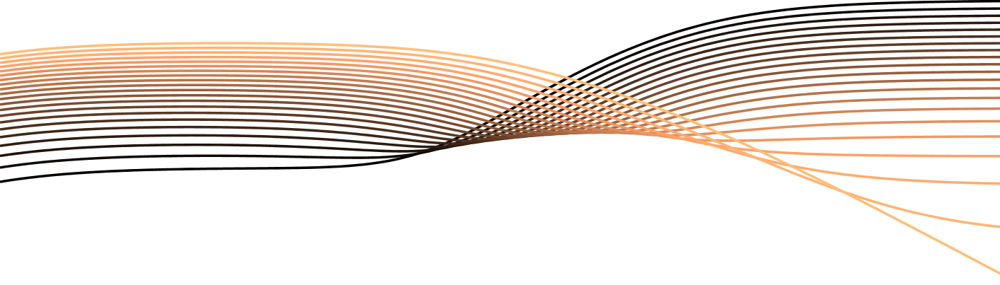

This is the companion webpage for the 22nd International Conference on Digital Audio Effects paper **"Potentiometer law modelling and identification for application in physics-based Virtual Analog circuits"** by Ben Holmes and Maarten van Walstijn.

## Contents

### 1. Additional material for modelling Alpha Potentiometers

#### 1.1. [Linear-cubic Piecewise Function](./alpha-pots/linear-cubic-func)

MATLAB code for creating a linear-cubic piecewise function.

#### 1.2. [Explicit solution to the cubic sub-function](./alpha-pots/cubic-subfunction)

#### 1.3. Modelling Alpha laws with a linear-cubic piecewise function

Plots and transitional values for the linear-cubic piecewise functions to model specified and measured characteristics from Alpha. [Download the measured potentiometer characteristics for both linear and logarithmic potentiometers here.](./alpha-pots/data/alpha_pots_csv.zip)

- **[Specified linear characteristics](./alpha-pots/linear-spec-fit)**
- **[Specified logarithmic characteristics](./alpha-pots/logarithmic-spec-fit)**
- **[Measured linear characteristics](./alpha-pots/linear-meas-fit)**
- **[Measured logarithmic characteristics](./alpha-pots/logarithmic-meas-fit)**

### 2. Big Muff Pi tonestack identification

#### 2.1. [Big Muff Pi tonestack model](./big-muff-pi-tonestack/tonestack-func)

MATLAB code to find the transfer function of the Big Muff Pi tonestack.

#### 2.2. [Big Muff Pi tonestack measurements](./big-muff-pi-tonestack/tonestack-measurements)

Measurement data collected from a breadboarded circuit of the Big Muff Pi tonestack.

#### 2.2. [Multisine excitation signal](./big-muff-pi-tonestack/multisine-func)

MATLAB code for generating the multisine excitation signal used in the measurement of the Big Muff Pi tonestack.

### Bibliography extension

[The latest potentiometer specification from the U.S.A. Department of Defense, MIL-R-94 G amendment 1, can be found here.](http://everyspec.com/MIL-PRF/MIL-PRF-000100-09999/MIL-PRF-94G_AMENDMENT-1_36619/)

[My doctoral thesis as referenced in the paper can be found here.](./thesis.pdf) This document is subject to change.
